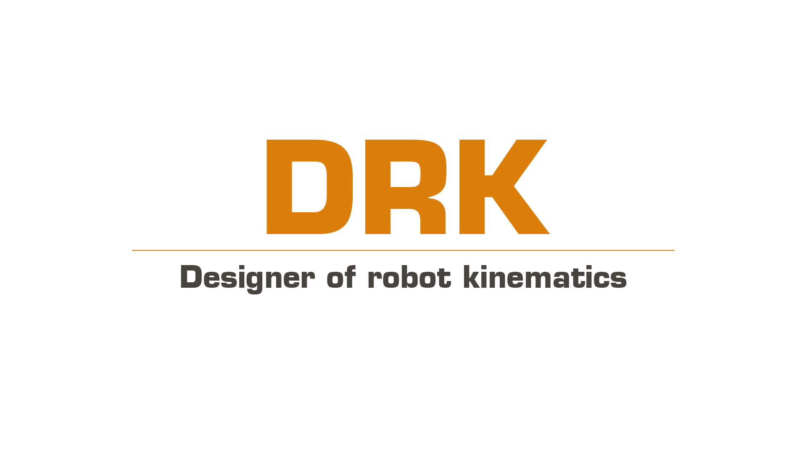

<p align="center">
  <a href="https://github.com/AndrewPst/DRK-designer_of_robot_kinematics">
    
  </a>

  <div align="center">
    <h3>Designer of robot kinematics & A tool for controlling robots.</h3><br/>
    <a href="https://github.com/AndrewPst/DRK-designer_of_robot_kinematics">Report Bug</a>
    .
    <a href="https://github.com/AndrewPst/DRK-designer_of_robot_kinematics">Request Feature</a>
  </div>
</p>

<div align="center">
  
   

</div>

## Table Of Contents

* [About the Project](#about-the-project)
* [Built With](#built-with)
* [Getting Started](#getting-started)
  * [Prerequisites](#prerequisites)
  * [Installation](#installation)
* [Usage](#usage)
* [Contributing](#contributing)
* [License](#license)
* [Authors](#authors)

## About The Project


DRK (designer of robot kinematics) allows you to build a kinematic diagram of your robot. You can move the working body of the robot to the coordinates you need. The telemetry of the robot allows you to monitor each of its links. Simulate the robot's work before executing the program on the robot itself.

Supported functions:

* Calculation of inverse kinematics;
* Calculation of forward kinematics;
* Robot Trajectory Constructor;
* Export ```.gcode``` files;
* Import ```.gcode``` files;
* Simulation of robot movement;

## Built With

* [Qt Framework](https://www.qt.io/)
* [MinGW-W64 8.1.0 compiler](https://www.mingw-w64.org/)
* [C++17](https://ru.wikipedia.org/wiki/C%2B%2B17)

## Getting Started

[Downloads](https://img.shields.io/github/downloads/AndrewPst/DRK-designer_of_robot_kinematics/total) the portable version of the program for your platform or build the application yourself by following the [instructions](#prerequisites) below:

### Prerequisites

* Install [Qt Framework](https://www.qt.io/download-qt-installer-oss);

### Installation

1. Clone repo;
2. Open the qt developer console;
3. Enter into the console:
  ```
  $ cd <project path>
  $ qmake -<project>
  $ qmake
  $ make
  $ ./DRK_designer_of_robot_kinematics.exe
  ```
or build a project in [Qt Creator](https://www.qt.io/product/development-tools)

## Usage

* Create a new project, configure the robot parameters and the environment for yourself;


* By moving the effector, create a motion program for the robot and run the simulation;
* You can import an already created file and edit it;


* Export the created program, copy the file to the robot's sd card and run the execution;

## Contributing

* If you have suggestions for adding or removing projects, feel free to [open an issue](https://github.com/AndrewPst/DRK-designer_of_robot_kinematics/issues/new) to discuss it, or directly create a pull request after you edit the *README.md* file with necessary changes.
* Please make sure you check your spelling and grammar.
* Create individual PR for each suggestion.

### Creating A Pull Request

1. Fork the Project
2. Create your Feature Branch (`git checkout -b feature/AmazingFeature`)
3. Commit your Changes (`git commit -m 'Add some AmazingFeature'`)
4. Push to the Branch (`git push origin feature/AmazingFeature`)
5. Open a Pull Request

## License

Distributed under the MIT License. See [LICENSE](/LICENSE) for more information.

## Authors

* **Andrew Pustovit** - *Comp Sci Student* - [AndrewPst](https://github.com/AndrewPst) - *DRK developer*
